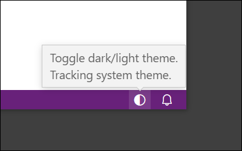

# Toggle Light/Dark Theme - VS Code Extension

<!--

-->

This extension provides a status bar button to quickly toggle between light/dark themes in VS Code.  This may be useful for anyone working under significantly changing background or reflected light levels. 

> If you are on Windows and would like to quickly toggle the whole system dark mode, you might be interested in the utility: [Toggle Dark/Light Mode](https://github.com/danielgjackson/toggle-dark-light).

## Features

* *Toggle Theme* command: `auto-dark-mode-windows.toggle` (see [History](#history) for name choice!)
* Status bar icon to quickly perform the theme switch: <code>&#x1F313;&#xFE0E;</code>
* Default hot-key: `Ctrl`+`Alt`+`Shift`+`T`

## Requirements

None.

## Extension Settings

No additional settings are provided.  

* The standard settings are used to customize the light/dark themes:

    * `workbench.preferredDarkColorTheme`
    * `workbench.preferredLightColorTheme`

* The operating system's light/dark mode can be automatically tracked by enabling the standard setting (the *Toggle Theme* command will temporarily override the theme):

    * `window.autoDetectColorScheme`

* The status bar icon (<code>&#x1F313;&#xFE0E;</code>) can be hidden/shown by right-clicking the status bar and selecting *Toggle Light/Dark Theme (Extension)*.

## Known Issues

None.

## Release Notes

See: [Change Log](CHANGELOG.md)

## History

VS Code before 2020 could not synchronize the theme to match the system dark mode, nor could the theme quickly be changed between light/dark modes.  

This extension was previously titled *Automatic Theme Switcher for Windows Dark Mode*, which automatically switched between dark/light themes to match the Windows Dark Mode (on *Windows 10 October 2018 Update* or later), and used the settings `autoDarkMode.darkTheme` and `autoDarkMode.lightTheme`.  The extension was partly inspired by a similar extension for *macOS Mojave*: [auto-dark-mode](https://marketplace.visualstudio.com/items?itemName=LinusU.auto-dark-mode).  

[VS Code V1.42 (January 2020)](https://code.visualstudio.com/updates/v1_42#_auto-switch-theme-based-on-os-color-scheme) introduced a standard setting to synchronize with the system dark mode as a built-in, cross-platform feature: *Window: Auto Detect Color Scheme* (`window.autoDetectColorScheme`).  This extension remained useful to quickly toggle between the standard light/dark theme preferences, regardless of the current system dark mode.

[VS Code V1.69 (June 2022)](https://code.visualstudio.com/updates/v1_69#_toggle-between-light-and-dark-themes) introduced a built-in command to quickly switch between themes: *Preferences: Toggle between Light/Dark Themes* (`workbench.action.toggleLightDarkThemes`).  A future version of this add-on will use this command instead, and will only really remain useful for the status bar icon which acts as a shortcut for this feature.

## Links

* [GitHub Page: danielgjackson/vscode-auto-dark-mode-windows](https://github.com/danielgjackson/vscode-auto-dark-mode-windows)
* [Visual Studio Marketplace: Toggle Light/Dark Theme](https://marketplace.visualstudio.com/items?itemName=danielgjackson.auto-dark-mode-windows)
